StripeSQL is a relational database management system written from scratch in C, with no dependencies beyond the C standard library and POSIX. It supports a SQL front end backed by a custom B+ tree storage engine with slotted-page file format.

---

## I. Architecture

A SQL query moves through five stages before touching the disk:

```
  ┌──────────────────────────────────────────────────────────┐
  │                      SQL Front End                       │
  │                                                          │
  │   SQL Query                                              │
  │      │                                                   │
  │      ▼                                                   │
  │  ┌────────┐    token    ┌────────┐    AST                │
  │  │ Lexer  │ ──────────► │ Parser │ ──────────────┐       │
  │  │lexer.c │             │parser.c│               │       │
  │  └────────┘             └────────┘               ▼       │
  │                                         ┌─────────────┐  │
  │                                         │  Generator  │  │
  │                                         │generator.c  │  │
  │                                         └──────┬──────┘  │
  │                                                │ bytecode│
  │                                                ▼         │
  │                                         ┌─────────────┐  │
  │                                         │     VM      │  │
  │                                         │    vm.c     │  │
  │                                         └──────┬──────┘  │
  └────────────────────────────────────────────────┼─────────┘
                                                   │
  ┌────────────────────────────────────────────────┼─────────┐
  │                   Storage Engine               │         │
  │                                                ▼         │
  │                                        ┌─────────────┐   │
  │                                        │   B+ Tree   │   │
  │                                        │   bplus.c   │   │
  │                                        └──────┬──────┘   │
  │                                               │          │
  │               ┌───────────────────────────────┤          │
  │               │               │               │          │
  │               ▼               ▼               ▼          │
  │        ┌───────────┐  ┌────────────┐  ┌────────────┐     │
  │        │   Page    │  │    Node    │  │  Ordering  │     │
  │        │  page.c   │  │   node.h   │  │ordering.c  │     │
  │        └─────┬─────┘  └────────────┘  └────────────┘     │
  │              │                                           │
  │              ▼                                           │
  │        ┌───────────┐                                     │
  │        │ Table I/O │   (.tbl files in tables/)           │
  │        │ tableIO.c │                                     │
  │        └───────────┘                                     │
  └──────────────────────────────────────────────────────────┘

  Schema (.scma) loaded by schema.c is shared between the Generator
  and VM to resolve column names and primary key positions.
```

**Lexer** (`src/SQL_interpreter/lexer.c`) — scans the raw query string into a flat token array. Multi-word clauses such as `INSERT INTO` are matched at the parse level, not here.

**Parser** (`src/SQL_interpreter/parser.c`) — consumes the token array and produces an AST. Each node carries a type tag, a keyword token, a flag for sub-variants (e.g. `DISTINCT`, `PRIMARY KEY`), and up to seven children.

**Generator** (`src/SQL_interpreter/generator.c`) — walks the AST and emits a bytecode `chunk` against the schema. Detects primary-key equality in `WHERE` clauses and emits `OP_KEY_SEARCH` instead of a scan loop.

**VM** (`src/SQL_interpreter/vm.c`) — stack-based interpreter that executes the bytecode chunk. Maintains up to four concurrent scanners, each holding a cursor into a B+ tree (`src/storage_engine/scanner.h`). A session-scoped transaction registry, kept outside the per-statement VM state, lets `BEGIN TRANSACTION` hold a table open — dirty writes uncommitted — across multiple statements until `COMMIT` or `DISCARD`.

**B+ tree** (`src/storage_engine/bplus.c`) — the index structure that maps page numbers to disk addresses. Leaf nodes link bidirectionally for sequential scans.

**Slotted page** (`src/storage_engine/page.c`) — variable-length records are stored in slotted pages. Each slot holds an offset key, a pointer into the entry array, and a byte length.

**Table I/O** (`src/storage_engine/tableIO.c`) — serialises pages and nodes to `.tbl` files in the `tables/` directory. Writes are buffered in dirty hashmaps, then written and synced to disk (`fsync`) on `commit()`.

---

## II. Supported Features

**Data Definition**
- `CREATE TABLE name (col type [PRIMARY KEY], ...)` — creates a new table and registers it in the schema
- `DROP TABLE name` — deletes the table file and removes the schema entry
- Column types: `int`, `text`
- `PRIMARY KEY` constraint on a single column per table

**Data Manipulation**
- `INSERT INTO table VALUES (v1, v2, ...)` — inserts a row; the primary key is converted to an internal page number via a reversible ordering transform (not a hash). String literals must be single-quoted (`'...'`); double-quoted or unquoted string values are reported as an error at compile time instead of being silently misparsed.
- `SELECT * FROM table` and `SELECT col1, col2, ... FROM table`
- `SELECT DISTINCT ...` — deduplicates result rows
- `UPDATE table SET col = expr [WHERE ...]`
- `DELETE FROM table [WHERE ...]`
- Referencing a table with no registered schema (e.g. a typo'd name) reports a compile error instead of crashing the interpreter, across `SELECT`, `INSERT`, `UPDATE`, and `DELETE`

**Transactions**
- `BEGIN TRANSACTION` — starts a transaction; every table touched by a subsequent statement stays open, with its writes buffered but not flushed to disk
- `COMMIT` — writes all changes made since `BEGIN TRANSACTION` to disk and closes the tables
- `DISCARD` — drops all changes made since `BEGIN TRANSACTION` without writing anything to disk
- A single transaction may span multiple tables
- `BEGIN TRANSACTION` while already in a transaction, or `COMMIT`/`DISCARD` with none active, reports an error and is a no-op
- Every commit — `COMMIT`, or the implicit commit at the end of each statement outside a transaction — is synced to disk with `fsync` before the statement returns (set `FULL_FSYNC` in `const.h` to use macOS's stronger `F_FULLFSYNC` instead). Read-only statements write and sync nothing. A failed write or sync is reported as a runtime error and is not retried.

**Filtering and Expressions**
- `WHERE` clause with `=`, `!=`, `<`, `<=`, `>`, `>=`
- `AND`, `OR`, `NOT` logical operators with correct precedence
- `LIKE` pattern matching
- `IS NULL` and `IS NOT NULL`
- Arithmetic: `+`, `-`, `*`, `/`, unary `-`

**Result Set Operations**
- `ORDER BY col [ASC | DESC]`
- `LIMIT n`

**Query Optimization**
- Primary key equality (`WHERE pk_col = literal`) uses `OP_KEY_SEARCH` — a direct B+ tree lookup — instead of a full table scan, in `SELECT`, `UPDATE`, and `DELETE` statements alike

**Execution Modes**
- Interactive REPL (`./main`)
- Batch file execution (`./main file.sql`) supporting multiple semicolon-delimited statements
- Single-line comments (`-- ...`) and block comments (`/* ... */`) in SQL files

---

## III. Roadmap

The following features are next on the todo list, roughly in priority order:

1. **Write-Ahead Logging** - Committed changes are already synced to disk, but a crash or write failure partway through a commit can leave a table half-updated (see Known Issues). WAL and crash recovery will make commits atomic across crashes.
2. **Crash recovery**
3. **Column reordering in queries** — `INSERT INTO t (b, a) VALUES (2, 1)` and `SELECT b, a FROM t` with non-natural column ordering are not yet handled.
4. **File-level garbage collection** — `condenseStripe` and `condenseAll` are stubbed in `tableIO.c`; implementing them will reclaim space from deleted records.
5. **Propagate I/O errors** — `readNode` and `readPage` currently do not propagate failure to callers.
6. **File structure analysis mode** - a new mode which creates a new database populated with the attributes of a given directory's files and subdirectories.

---

## IV. Known Issues

| # | Description |
|---|-------------|
| 1 | Entering a blank line in the REPL causes a segfault. As a workaround, always enter a valid SQL statement or `Ctrl-D` to exit. |
| 2 | `readNode` and `readPage` silently swallow I/O errors instead of returning a failure code to the caller. |
| 3 | Column reordering in `INSERT` and `SELECT` is not supported — column order in a query must match the order declared in `CREATE TABLE`. |
| 4 | A fatal error partway through a transaction (e.g. a compile error, which calls `exit()`) does not auto-`DISCARD` — the transaction's open table handles are simply leaked without committing or writing back. |
| 5 | There is no page overflow policy — if enough records collide onto the same physical page, insertion becomes impossible until the page is emptied. Primary-key dispersion (both integer and text keys use a reversible bit/byte-reversal transform before bucketing) makes this rare in practice, and a failed insert now reports an error rather than silently dropping the row, but no page-split or overflow-chain mechanism exists yet. |
| 6 | Commits are durable but not crash-atomic. A commit overwrites pages and nodes in place and then the table header, so a crash, power loss, or failed write partway through can leave the table file half-updated, and nothing on disk can undo it. The failure is reported, but the affected table may be corrupt until write-ahead logging is in place (see Roadmap). |

---

## V. Usage

### Build

```sh
make
```

This compiles all source files with `clang` at `-O3` and produces the `main` binary in the project root. Requires `clang` and `make`.

### Run the REPL

```sh
./main
```

Type SQL statements ending with `;` and press Enter. Press `Ctrl-D` to exit. Do not enter blank lines (see Known Issues).

### Run a SQL file

```sh
./main file.sql
```

All statements in the file are executed in order. The total wall-clock time is printed after the last statement. Exit codes mirror the POSIX convention: `65` for a compile error, `70` for a runtime error, `60` for a load error.

### Debug mode

```sh
./main -d          # REPL with debug tracing
./main file.sql -d # file mode with debug tracing
```

Debug mode prints the disassembled bytecode chunk before execution.

### Example session

```sql
CREATE TABLE users (id int PRIMARY KEY, name text);
INSERT INTO users VALUES (1, 'alice');
INSERT INTO users VALUES (4, 'donald');
SELECT * FROM users WHERE id = 4;
```

Expected output:
```
4 | donald
(1 row)
```

### Example session with a transaction

```sql
BEGIN TRANSACTION;
INSERT INTO users VALUES (7, 'grace');
DISCARD;
SELECT * FROM users WHERE id = 7;
```

Expected output: `grace` was never committed, so the lookup returns nothing.
```
(0 rows)
```

---

## VI. Extending the Engine

The pipeline is layered, so adding a new SQL feature follows a fixed sequence of steps.

**1. Add a keyword token** (`src/SQL_interpreter/lexer.c` / `lexer.h`)
Add the new keyword to the `token_type` enum and register it in the keyword-matching table inside `lexer.c`.

**2. Add an AST node type** (`src/SQL_interpreter/parser.h`)
If the new feature introduces a new clause or statement, add a variant to `ast_type` and, if needed, a flag to `ast_flag`.

**3. Parse the new syntax** (`src/SQL_interpreter/parser.c`)
Write a `parse*` function that consumes the relevant tokens and returns an `ast_node`. Hook it into the top-level `query()` dispatcher.

**4. Add opcodes** (`src/SQL_interpreter/chunk.h`)
If new VM behaviour is needed, extend the `opcode` enum. Single-byte opcodes with optional one- or two-byte operands follow the existing pattern.

**5. Generate bytecode** (`src/SQL_interpreter/generator.c`)
Extend `munchStmt` (or `munchExpr`) to handle the new AST node and emit the corresponding opcodes.

**6. Implement the opcode** (`src/SQL_interpreter/vm.c`)
Add a `case` to the dispatch loop in `run()`. Operations that touch the disk go through the scanner and the B+ tree API in `bplus.c`.

**7. Update the schema if needed** (`src/SQL_interpreter/schema.c`)
If the feature introduces a new per-table or per-column attribute, extend the `schema` struct and update the binary serialisation in `schema.c`.

---

## VII. Benchmarks

Execution time is reported automatically after every file-mode run (wall-clock, measured with `CLOCK_MONOTONIC`):

```
./main file.sql
...
 1.243 ms
```

All figures below were measured on an Apple M2 with an `-O3` build (the Makefile's flags, no sanitizers, default `FULL_FSYNC 0` so every commit is synced with plain `fsync`) and a warm OS page cache. Each is the median of 5 trials, taken after one discarded warm-up run. They will vary with page fill factor, tree depth, `M_GLOBAL`, and disk speed.

### Primary-key lookup vs. full scan

A table `(id int PRIMARY KEY, v int)` is loaded with N rows where `v = id`, so both columns hold identical values. Random keys are then looked up two ways: `WHERE id = k`, which compiles to `OP_KEY_SEARCH` (a B+ tree descent), and `WHERE v = k`, which has no index and falls back to a full table scan. Each lookup runs as its own statement, and the built-in timer's total is divided by the number of queries (1,000 index lookups per trial; fewer scans at larger N, since each one reads the whole table). Every query is checked to return exactly the expected row.

| Rows | PK lookup | Full scan | Speedup |
|-----:|----------:|----------:|--------:|
| 1,000 | 0.27 ms | 33.1 ms | 123× |
| 10,000 | 0.31 ms | 333 ms | 1,074× |
| 100,000 | 0.38 ms | 3,658 ms | ~9,500× |

- **Lookup latency is nearly flat.** It grows 43% across a 100× increase in rows, while scan time grows roughly linearly — the O(log n) vs. O(n) difference the index exists for. Lookups are read-only, so they never sync.
- **The scan side is inflated by storage footprint.** The table file takes about 5.4 KB per row (536 MB at 100,000 rows), so a full scan reads far more data than the rows themselves contain. A denser page layout would shrink scan times, and the speedup with them.

### Transaction batching

10,000 sequential `INSERT`s are run twice: once in autocommit mode, where every statement opens the table file, writes its changes back, and closes it; and once wrapped in a single `BEGIN TRANSACTION` / `COMMIT`, where dirty pages and nodes stay buffered until the commit. These scripts contain only the `CREATE TABLE` and the inserts, timed with the built-in timer.

| Primary key | Autocommit | Single transaction | Speedup | Inserts/sec (transaction) |
|-------------|-----------:|-------------------:|--------:|--------------------------:|
| `int` | 6.18 s | 0.265 s | 23.3× | ~37,800 |
| `text` | 6.26 s | 0.278 s | 22.5× | ~35,900 |

Autocommit pays for 10,000 syncs where the transaction pays for one, but on macOS a plain `fsync` is cheap: syncing added only about 0.6 s to the autocommit runs. Most of the gap is still the per-statement cost of opening, writing back, and closing the table file 10,000 times. With `FULL_FSYNC` set, each sync costs about 3 ms on this machine, so syncs would dominate the autocommit runs instead.

### Comparison with SQLite

The `benchmarks/` directory contains four workloads. Each creates a table, inserts 10,000 sequential rows (integer or text primary key, bare or wrapped in one transaction), then runs `DELETE FROM` and `DROP TABLE`. Both engines are timed the same way: wall-clock time for the whole process, including startup, with a fresh database every trial. SQLite 3.45.3 runs the identical script through its CLI on default settings: rollback journal (`journal_mode=delete`), `synchronous=FULL`, no custom pragmas.

| Benchmark | StripeSQL | SQLite | Ratio |
|-----------|----------:|-------:|------:|
| `10k.sql` (int PK, no transaction) | 6.62 s | 2.66 s | 2.5× |
| `10k_txn.sql` (int PK, single transaction) | 0.853 s | 0.019 s | 45× |
| `10k_str.sql` (text PK, no transaction) | 6.86 s | 2.75 s | 2.5× |
| `10k_str_txn.sql` (text PK, single transaction) | 0.859 s | 0.022 s | 40× |

```mermaid
xychart-beta
    title "StripeSQL vs SQLite — median seconds over 5 trials (lower is better)"
    x-axis ["10k", "10k_txn", "10k_str", "10k_str_txn"]
    y-axis "Seconds" 0 --> 7
    bar "StripeSQL" [6.616, 0.853, 6.861, 0.859]
    bar "SQLite" [2.663, 0.019, 2.746, 0.022]
```



- **Both engines sync every commit.** Each bare `INSERT` is its own transaction on both engines, and neither returns until the commit is synced: StripeSQL syncs the table file, SQLite (rollback journal, `synchronous=FULL`) syncs its journal and database file. Neither uses `F_FULLFSYNC` by default. The remaining difference in guarantees is atomicity: SQLite's journal lets it roll back a commit interrupted by a crash, which StripeSQL can't do until write-ahead logging lands (see Known Issues).
- **In the transaction runs, most of StripeSQL's time is the closing `DELETE FROM`.** It takes about 0.57 s of the ~0.85 s total, because every emptied page is removed from the B+ tree individually, with borrow/merge rebalancing along the way; SQLite erases a table's contents wholesale when `DELETE` has no `WHERE` clause. The inserts themselves take about 0.27 s (see Transaction batching). The B+ tree's linear search within nodes, and node structs allocated at the full configured order (`M_GLOBAL`, see `const.h`) regardless of fill, are other identified costs relative to SQLite's B-tree.
- Text and integer primary keys track each other closely on both engines, so StripeSQL's key-dispersion scheme (see Known Issues) isn't adding meaningful overhead of its own.

---

## VIII. Attributions and Outro

The interpreter architecture — bytecode chunk, stack-based VM, single-pass code generator — was inspired by Robert Nystrom's [*Crafting Interpreters*](https://craftinginterpreters.com/). The storage engine (B+ tree, slotted pages, dirty-hashmap write-back, etc.) was designed and implemented independently.

Copyright (c) 2026 Ethan Kothavale. Distributed under the MIT License — see [LICENSE.md](LICENSE.md), or the license header in any source file, for the full text.
