StripeSQL is a relational database management system written from scratch in C, with no dependencies beyond the C standard library and POSIX. It supports a SQL front end backed by a custom B+ tree storage engine with slotted-page file format.

---

## I. Architecture

A SQL query moves through five stages before touching the disk:

```
  ┌──────────────────────────────────────────────────────────┐
  │                      SQL Front End                       │
  │                                                          │
  │   SQL Query                                              │
  │      │                                                   │
  │      ▼                                                   │
  │  ┌────────┐    token    ┌────────┐    AST                │
  │  │ Lexer  │ ──────────► │ Parser │ ──────────────┐       │
  │  │lexer.c │             │parser.c│               │       │
  │  └────────┘             └────────┘               ▼       │
  │                                         ┌─────────────┐  │
  │                                         │  Generator  │  │
  │                                         │generator.c  │  │
  │                                         └──────┬──────┘  │
  │                                                │ bytecode│
  │                                                ▼         │
  │                                         ┌─────────────┐  │
  │                                         │     VM      │  │
  │                                         │    vm.c     │  │
  │                                         └──────┬──────┘  │
  └────────────────────────────────────────────────┼─────────┘
                                                   │
  ┌────────────────────────────────────────────────┼─────────┐
  │                   Storage Engine               │         │
  │                                                ▼         │
  │                                        ┌─────────────┐   │
  │                                        │   B+ Tree   │   │
  │                                        │   bplus.c   │   │
  │                                        └──────┬──────┘   │
  │                                               │          │
  │               ┌───────────────────────────────┤          │
  │               │               │               │          │
  │               ▼               ▼               ▼          │
  │        ┌───────────┐  ┌────────────┐  ┌────────────┐     │
  │        │   Page    │  │    Node    │  │  Ordering  │     │
  │        │  page.c   │  │   node.h   │  │ordering.c  │     │
  │        └─────┬─────┘  └────────────┘  └────────────┘     │
  │              │                                           │
  │              ▼                                           │
  │        ┌───────────┐                                     │
  │        │ Table I/O │   (.tbl files in tables/)           │
  │        │ tableIO.c │                                     │
  │        └─────┬─────┘                                     │
  │              │ each commit is logged before the          │
  │              ▼ table files are written                   │
  │        ┌───────────┐                                     │
  │        │    WAL    │   (redo log: tables/stripe.log)     │
  │        │   wal.c   │                                     │
  │        └───────────┘                                     │
  └──────────────────────────────────────────────────────────┘

  Schema (.scma) loaded by schema.c is shared between the Generator
  and VM to resolve column names and primary key positions.
```

**Lexer** (`src/SQL_interpreter/lexer.c`) — scans the raw query string into a flat token array. Multi-word clauses such as `INSERT INTO` are matched at the parse level, not here.

**Parser** (`src/SQL_interpreter/parser.c`) — consumes the token array and produces an AST. Each node carries a type tag, a keyword token, a flag for sub-variants (e.g. `DISTINCT`, `PRIMARY KEY`), and up to seven children.

**Generator** (`src/SQL_interpreter/generator.c`) — walks the AST and emits a bytecode `chunk` against the schema. Detects primary-key equality in `WHERE` clauses and emits `OP_KEY_SEARCH` instead of a scan loop.

**VM** (`src/SQL_interpreter/vm.c`) — stack-based interpreter that executes the bytecode chunk. Maintains up to four concurrent scanners, each holding a cursor into a B+ tree (`src/storage_engine/scanner.h`). A session-scoped transaction registry, kept outside the per-statement VM state, lets `BEGIN TRANSACTION` hold a table open — dirty writes uncommitted — across multiple statements until `COMMIT` or `DISCARD`.

**B+ tree** (`src/storage_engine/bplus.c`) — the index structure that maps page numbers to disk addresses. Leaf nodes link bidirectionally for sequential scans.

**Slotted page** (`src/storage_engine/page.c`) — variable-length records are stored in slotted pages. Each slot holds an offset key, a pointer into the entry array, and a byte length.

**Table I/O** (`src/storage_engine/tableIO.c`) — serialises pages and nodes to `.tbl` files in the `tables/` directory. Writes are buffered in dirty hashmaps until a commit, which sends them through the write-ahead log before writing and syncing (`fsync`) the table files. A new table exists only in memory until its first commit creates its file. While a statement runs, the first change it makes to each page, node, or delete marker saves a copy of that object's prior pending version, so a statement that fails can be rolled back without disturbing earlier statements in the same transaction.

**Write-ahead log** (`src/storage_engine/wal.c`) — a redo log in `tables/stripe.log` that makes commits atomic across crashes. At commit, every change is appended as a fixed-size entry with a CRC-32C checksum: the exact bytes of each dirty page, node, delete marker, and table header, plus whole-file operations — creating a new table's file, rewriting the schema file, or removing a dropped table's file. The log is synced, a checksummed commit marker is appended and synced (the commit point), the changes are made to the files, which are synced along with their directory, and the log is truncated. At startup, recovery replays a committed log — every entry is safe to repeat, so it doesn't need to know which changes finished before the crash — or discards an uncommitted one. Uncommitted changes never leave memory, so there is never anything on disk to undo. The log names files within `tables/` and knows nothing about what's in them.

**File helpers** (`src/storage_engine/file.c`) — format-independent utilities shared by Table I/O and the write-ahead log: syncing files and directories, and big-endian integer encoding.

---

## II. Supported Features

**Data Definition**
- `CREATE TABLE name (col type [PRIMARY KEY], ...)` — creates a new table and registers it in the schema, committed together so a crash can't leave one without the other
- `DROP TABLE name` — removes the schema entry and deletes the table file, committed together
- Column types: `int`, `text`
- `PRIMARY KEY` constraint on a single column per table

**Data Manipulation**
- `INSERT INTO table VALUES (v1, v2, ...)` — inserts a row; the primary key is converted to an internal page number via a reversible ordering transform (not a hash). String literals must be single-quoted (`'...'`); double-quoted or unquoted string values are reported as an error at compile time instead of being silently misparsed.
- `SELECT * FROM table` and `SELECT col1, col2, ... FROM table`
- `SELECT DISTINCT ...` — deduplicates result rows
- `UPDATE table SET col = expr [WHERE ...]`
- `DELETE FROM table [WHERE ...]`
- Referencing a table with no registered schema (e.g. a typo'd name) reports a compile error instead of crashing the interpreter, across `SELECT`, `INSERT`, `UPDATE`, and `DELETE`

**Transactions**
- Transactions are ACID for a single process: commits are atomic and durable across crashes, statements are atomic, and only one process can use a database at a time (see Execution Modes). With the default `FULL_FSYNC 0`, durability covers process and OS crashes; set `FULL_FSYNC 1` in `const.h` to also survive power loss on macOS.
- `BEGIN TRANSACTION` — starts a transaction; every table touched by a subsequent statement stays open, with its writes buffered but not flushed to disk
- `COMMIT` — commits all changes made since `BEGIN TRANSACTION` to disk and closes the tables; the changes to every table touched are committed together, so after a crash either all of them survive or none do
- `DISCARD` — drops all changes made since `BEGIN TRANSACTION` without writing anything to disk
- A single transaction may span multiple tables
- `BEGIN TRANSACTION` while already in a transaction, or `COMMIT`/`DISCARD` with none active, is a runtime error
- `CREATE TABLE` and `DROP TABLE` can't run inside a transaction: they always commit on their own, so `DISCARD` couldn't undo them
- Every commit — `COMMIT`, or the implicit commit at the end of each statement outside a transaction — goes through the write-ahead log and is durable before the statement returns. So do `CREATE TABLE`, `DROP TABLE`, and every schema change. If the process crashes mid-commit, the next startup finishes or discards the commit, so a table never holds part of one. Syncs use `fsync` (set `FULL_FSYNC` in `const.h` to use macOS's stronger `F_FULLFSYNC` instead). Read-only statements write and sync nothing.
- Statements are atomic. Any error while a statement runs — a duplicate primary key, a full page, a type error, division by zero — halts it as a runtime error, and everything it changed is rolled back. Inside a transaction, earlier statements' changes stay pending and the transaction carries on; outside one, nothing was committed.
- A write failure before the commit point aborts the transaction with a runtime error. A failure after it, when the commit is already in the log but a table may be half-written, exits with code `74`, and recovery completes the commit on the next startup. Failures are never retried.

**Filtering and Expressions**
- `WHERE` clause with `=`, `!=`, `<`, `<=`, `>`, `>=`
- `AND`, `OR`, `NOT` logical operators with correct precedence
- `LIKE` pattern matching
- `IS NULL` and `IS NOT NULL`
- Arithmetic: `+`, `-`, `*`, `/`, unary `-`

**Result Set Operations**
- `ORDER BY col [ASC | DESC]`
- `LIMIT n`

**Query Optimization**
- Primary key equality (`WHERE pk_col = literal`) uses `OP_KEY_SEARCH` — a direct B+ tree lookup — instead of a full table scan, in `SELECT`, `UPDATE`, and `DELETE` statements alike

**Execution Modes**
- Interactive REPL (`./main`)
- Batch file execution (`./main file.sql`) supporting multiple semicolon-delimited statements
- Single-line comments (`-- ...`) and block comments (`/* ... */`) in SQL files
- One process at a time: StripeSQL holds an exclusive lock on `tables/stripe.lock` for as long as it runs; a second process exits with code `75`. The OS releases the lock when the process exits, even after a crash

---

## III. Roadmap

The following features are next on the todo list, roughly in priority order:

1. **Column reordering in queries** — `INSERT INTO t (b, a) VALUES (2, 1)` and `SELECT b, a FROM t` with non-natural column ordering are not yet handled.
2. **File-level garbage collection** — `condenseStripe` and `condenseAll` are stubbed in `tableIO.c`; implementing them will reclaim space from deleted records.
3. **Propagate I/O errors** — `readNode` and `readPage` currently do not propagate failure to callers.
4. **File structure analysis mode** - a new mode which creates a new database populated with the attributes of a given directory's files and subdirectories.

---

## IV. Known Issues

| # | Description |
|---|-------------|
| 1 | Entering a blank line in the REPL causes a segfault. As a workaround, always enter a valid SQL statement or `Ctrl-D` to exit. |
| 2 | `readNode` and `readPage` silently swallow I/O errors instead of returning a failure code to the caller. |
| 3 | Column reordering in `INSERT` and `SELECT` is not supported — column order in a query must match the order declared in `CREATE TABLE`. |
| 4 | A fatal error partway through a transaction (e.g. a compile error, which calls `exit()`) does not auto-`DISCARD` — the transaction's open table handles are simply leaked without committing or writing back. |
| 5 | There is no page overflow policy — if enough records collide onto the same physical page, insertion becomes impossible until the page is emptied. Primary-key dispersion (both integer and text keys use a reversible bit/byte-reversal transform before bucketing) makes this rare in practice, and a failed insert now reports an error rather than silently dropping the row, but no page-split or overflow-chain mechanism exists yet. |
| 6 | Power loss on macOS: with the default `FULL_FSYNC 0`, a plain `fsync` leaves data in the drive's cache, which the drive may also reorder, so recently committed transactions are only guaranteed to survive a process or OS crash. Set `FULL_FSYNC 1` in `const.h` to survive power loss (at about 3 ms per sync). |

---

## V. Usage

### Build

```sh
make
```

This compiles all source files with `clang` at `-O3` and produces the `main` binary in the project root. Requires `clang` and `make`.

### Run the REPL

```sh
./main
```

Type SQL statements ending with `;` and press Enter. Press `Ctrl-D` to exit. Do not enter blank lines (see Known Issues).

### Run a SQL file

```sh
./main file.sql
```

All statements in the file are executed in order. The total wall-clock time is printed after the last statement. Exit codes mirror the POSIX convention: `65` for a compile error, `70` for a runtime error, `60` for a load error, and `74` for an I/O error (a script that can't be read, a commit that fails after its commit point, or crash recovery that can't finish), and `75` when another StripeSQL process is using the database.

### Crash recovery

Every run starts by checking `tables/stripe.log`. If a previous run crashed partway through a commit, it prints one of:

```
Recovery: finished an interrupted commit (N log entries)
Recovery: discarded an uncommitted transaction
```

If a committed log is damaged and can't be replayed, StripeSQL exits with code `74` and leaves the log in place for inspection.

### Crash-recovery test (macOS only)

```sh
make crashtest
```

Runs `crashtest/crashtest.py`, which kills StripeSQL just before every file write and `fsync` of a commit, then restarts it and checks that recovery left each table holding exactly its pre-commit or post-commit contents, with primary-key lookups agreeing with full scans and the log empty afterwards. It covers a two-table transaction whose inserts split B+ tree nodes, an autocommit `INSERT`, an autocommit `DELETE`, `CREATE TABLE`, and `DROP TABLE` (215 crash points in all); for `CREATE` and `DROP` it also checks that a table never has a file without a schema entry or the reverse. The kill is done by `crashtest/syncspy.c`, a library injected with `DYLD_INSERT_LIBRARIES` that intercepts `write` and `fsync`, so it models a process crash rather than power loss. It runs in a temporary directory and never touches `tables/`. Requires Python 3.

### Debug mode

```sh
./main -d          # REPL with debug tracing
./main file.sql -d # file mode with debug tracing
```

Debug mode prints the disassembled bytecode chunk before execution.

### Example session

```sql
CREATE TABLE users (id int PRIMARY KEY, name text);
INSERT INTO users VALUES (1, 'alice');
INSERT INTO users VALUES (4, 'donald');
SELECT * FROM users WHERE id = 4;
```

Expected output:
```
4 | donald
(1 row)
```

### Example session with a transaction

```sql
BEGIN TRANSACTION;
INSERT INTO users VALUES (7, 'grace');
DISCARD;
SELECT * FROM users WHERE id = 7;
```

Expected output: `grace` was never committed, so the lookup returns nothing.
```
(0 rows)
```

---

## VI. Extending the Engine

The pipeline is layered, so adding a new SQL feature follows a fixed sequence of steps.

**1. Add a keyword token** (`src/SQL_interpreter/lexer.c` / `lexer.h`)
Add the new keyword to the `token_type` enum and register it in the keyword-matching table inside `lexer.c`.

**2. Add an AST node type** (`src/SQL_interpreter/parser.h`)
If the new feature introduces a new clause or statement, add a variant to `ast_type` and, if needed, a flag to `ast_flag`.

**3. Parse the new syntax** (`src/SQL_interpreter/parser.c`)
Write a `parse*` function that consumes the relevant tokens and returns an `ast_node`. Hook it into the top-level `query()` dispatcher.

**4. Add opcodes** (`src/SQL_interpreter/chunk.h`)
If new VM behaviour is needed, extend the `opcode` enum. Single-byte opcodes with optional one- or two-byte operands follow the existing pattern.

**5. Generate bytecode** (`src/SQL_interpreter/generator.c`)
Extend `munchStmt` (or `munchExpr`) to handle the new AST node and emit the corresponding opcodes.

**6. Implement the opcode** (`src/SQL_interpreter/vm.c`)
Add a `case` to the dispatch loop in `run()`. Operations that touch the disk go through the scanner and the B+ tree API in `bplus.c`.

**7. Update the schema if needed** (`src/SQL_interpreter/schema.c`)
If the feature introduces a new per-table or per-column attribute, extend the `schema` struct and update the binary serialisation in `schema.c`.

---

## VII. Benchmarks

Execution time is reported automatically after every file-mode run (wall-clock, measured with `CLOCK_MONOTONIC`):

```
./main file.sql
...
 1.243 ms
```

All figures below were measured on an Apple M2 with an `-O3` build (the Makefile's flags, no sanitizers; default `FULL_FSYNC 0`, so every commit goes through the write-ahead log with plain `fsync`) and a warm OS page cache. Each is the median of 5 trials, taken after one discarded warm-up run. They will vary with page fill factor, tree depth, `M_GLOBAL`, and disk speed.

### Primary-key lookup vs. full scan

A table `(id int PRIMARY KEY, v int)` is loaded with N rows where `v = id`, so both columns hold identical values. Random keys are then looked up two ways: `WHERE id = k`, which compiles to `OP_KEY_SEARCH` (a B+ tree descent), and `WHERE v = k`, which has no index and falls back to a full table scan. Each lookup runs as its own statement, and the built-in timer's total is divided by the number of queries (1,000 index lookups per trial; fewer scans at larger N, since each one reads the whole table). Every query is checked to return exactly the expected row.

| Rows | PK lookup | Full scan | Speedup |
|-----:|----------:|----------:|--------:|
| 1,000 | 0.27 ms | 32.1 ms | 120× |
| 10,000 | 0.32 ms | 329 ms | 1,031× |
| 100,000 | 0.42 ms | 3,838 ms | ~9,100× |

- **Lookup latency is nearly flat.** It grows 58% across a 100× increase in rows, while scan time grows roughly linearly — the O(log n) vs. O(n) difference the index exists for. Lookups are read-only, so they never touch the log or sync.
- **The scan side is inflated by storage footprint.** The table file takes about 5.4 KB per row (536 MB at 100,000 rows), so a full scan reads far more data than the rows themselves contain. A denser page layout would shrink scan times, and the speedup with them.

### Transaction batching

10,000 sequential `INSERT`s are run twice: once in autocommit mode, where every statement opens the table file, writes its changes back, and closes it; and once wrapped in a single `BEGIN TRANSACTION` / `COMMIT`, where dirty pages and nodes stay buffered until the commit. These scripts contain only the `CREATE TABLE` and the inserts, timed with the built-in timer.

| Primary key | Autocommit | Single transaction | Speedup | Inserts/sec (transaction) |
|-------------|-----------:|-------------------:|--------:|--------------------------:|
| `int` | 7.60 s | 0.449 s | 16.9× | ~22,300 |
| `text` | 7.75 s | 0.496 s | 15.6× | ~20,100 |

Every commit writes each changed object twice — once to the write-ahead log as a 4.4 KB entry, once to the table file — and syncs four times: twice for the log, once per table file, and once to truncate the log. Autocommit pays that 10,000 times where the transaction pays it once. Each statement also copies the prior version of every already-pending page or node it changes, so a failed statement can be rolled back; that's what makes the transaction runs a few percent slower than the commit count alone would suggest. On macOS a plain `fsync` is cheap (about 40 µs here), so most of the autocommit time is per-statement work: opening the table file, logging and writing back its changes, and closing it. With `FULL_FSYNC` set, each sync costs about 3 ms on this machine, so syncs would dominate the autocommit runs instead.

### Comparison with SQLite

The `benchmarks/` directory contains four workloads. Each creates a table, inserts 10,000 sequential rows (integer or text primary key, bare or wrapped in one transaction), then runs `DELETE FROM` and `DROP TABLE`. Both engines are timed the same way: wall-clock time for the whole process, including startup, with a fresh database every trial. SQLite 3.45.3 runs the identical script through its CLI on default settings: rollback journal (`journal_mode=delete`), `synchronous=FULL`, no custom pragmas.

| Benchmark | StripeSQL | SQLite | Ratio |
|-----------|----------:|-------:|------:|
| `10k.sql` (int PK, no transaction) | 8.51 s | 2.74 s | 3.1× |
| `10k_txn.sql` (int PK, single transaction) | 1.25 s | 0.019 s | 66× |
| `10k_str.sql` (text PK, no transaction) | 8.80 s | 2.79 s | 3.2× |
| `10k_str_txn.sql` (text PK, single transaction) | 1.22 s | 0.020 s | 60× |

```mermaid
xychart-beta
    title "StripeSQL vs SQLite — median seconds over 5 trials (lower is better)"
    x-axis ["10k", "10k_txn", "10k_str", "10k_str_txn"]
    y-axis "Seconds" 0 --> 9
    bar "StripeSQL" [8.507, 1.254, 8.804, 1.215]
    bar "SQLite" [2.737, 0.019, 2.786, 0.020]
```



- **Both engines give the same guarantee.** Each bare `INSERT` is its own transaction on both, and every commit — including `CREATE TABLE` and `DROP TABLE` — is durable and atomic across crashes: SQLite journals the original pages before overwriting them (rollback journal, `synchronous=FULL`), StripeSQL logs the new ones (a redo log), and neither returns until the commit is synced. Neither uses `F_FULLFSYNC` by default.
- **In the transaction runs, most of StripeSQL's time is the closing `DELETE FROM`.** It takes about 0.73 s of the ~1.2 s total, because every emptied page is removed from the B+ tree individually, with borrow/merge rebalancing along the way; SQLite erases a table's contents wholesale when `DELETE` has no `WHERE` clause. The inserts themselves take about 0.45 s (see Transaction batching). The B+ tree's linear search within nodes, and node structs allocated at the full configured order (`M_GLOBAL`, see `const.h`) regardless of fill, are other identified costs relative to SQLite's B-tree.
- Text and integer primary keys track each other closely on both engines, so StripeSQL's key-dispersion scheme (see Known Issues) isn't adding meaningful overhead of its own.

---

## VIII. Attributions and Outro

The interpreter architecture — bytecode chunk, stack-based VM, single-pass code generator — was inspired by Robert Nystrom's [*Crafting Interpreters*](https://craftinginterpreters.com/). The storage engine (B+ tree, slotted pages, dirty-hashmap write-back, etc.) was designed and implemented independently.

Copyright (c) 2026 Ethan Kothavale. Distributed under the MIT License — see [LICENSE.md](LICENSE.md), or the license header in any source file, for the full text.
